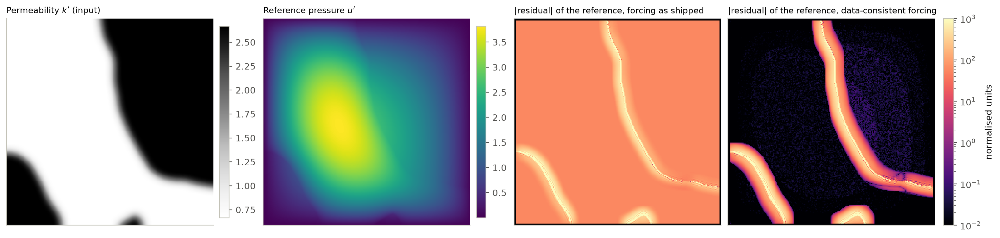
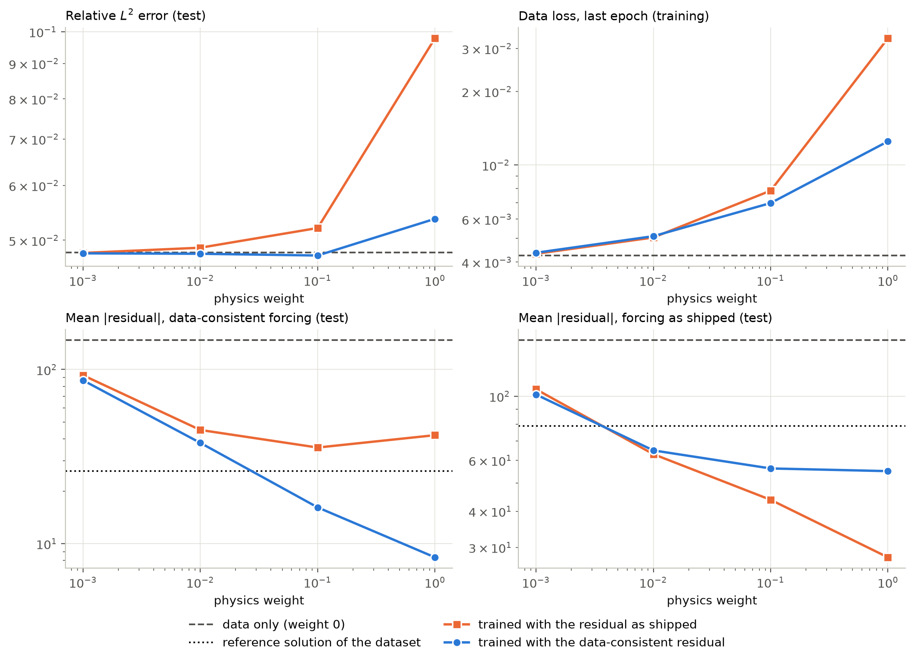
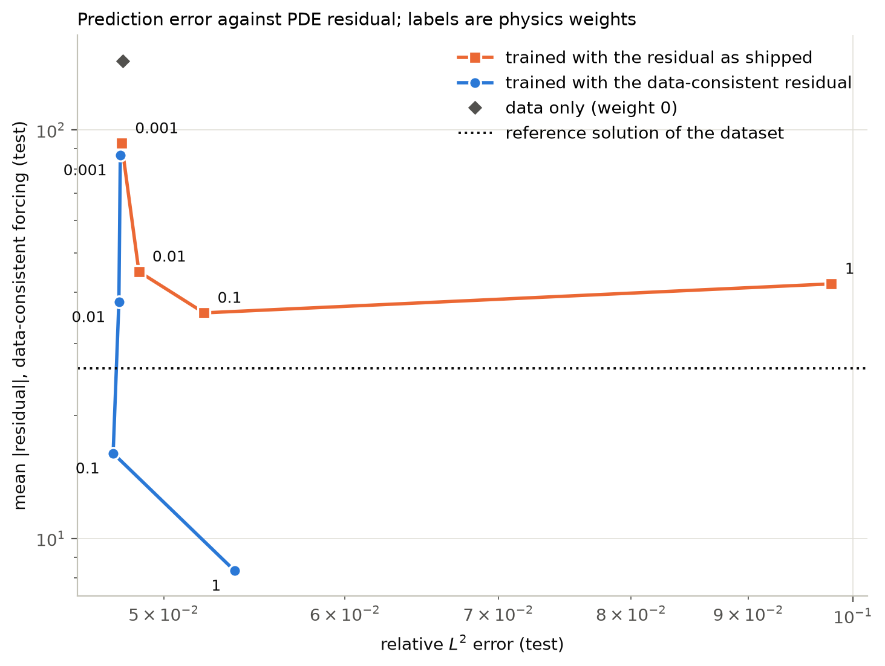
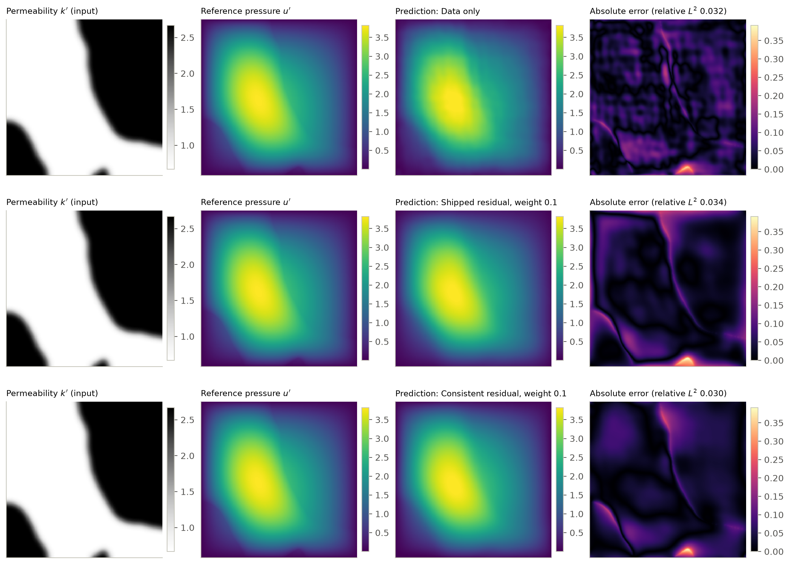
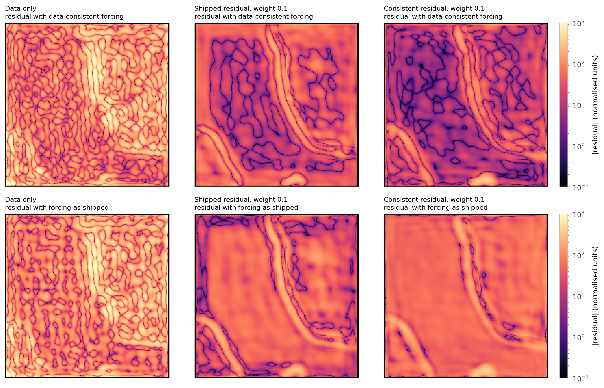
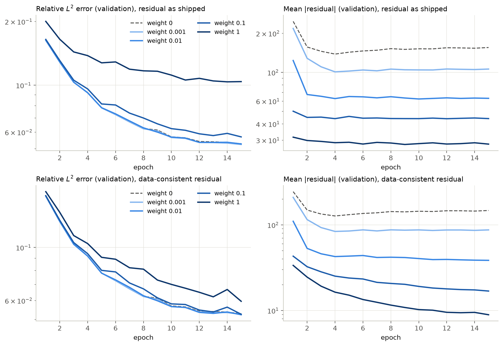

# Physics weighting in the PhysicsNeMo physics-informed Darcy FNO

A controlled study of one hyperparameter of NVIDIA PhysicsNeMo's physics-informed Darcy flow example: the weight of the PDE residual term in the training loss. The model, the residual operator and the training loop are NVIDIA's. This repository adds the experiment around them: a check of what the training data and the residual actually represent, a sweep of the physics weight with a data-only baseline, separate records of the data and PDE terms, evaluation on a held-out test set, and figures.

The question:

> How does the weight of the physics term change the prediction error and the PDE residual of the trained operator?

## Summary

- The upstream example trains a Fourier Neural Operator (FNO) with the loss `MSE + (physics_weight / 240) * mean|PDE residual|`. The residual is computed with finite differences on the output grid (the PINO approach), not with automatic differentiation.
- The forcing term of the upstream residual does not match the dataset. In the normalised variables the data satisfy $-\nabla\cdot(k'\nabla u') = 57.2$; the upstream script uses $0.0175$, the reciprocal. The reference solutions of the dataset therefore have a residual of 56.7 in almost every cell under the upstream definition.
- The study sweeps the physics weight for both definitions: the residual **as shipped** (the upstream behaviour) and a **data-consistent** residual (corrected forcing and grid spacing), with one shared data-only model.
- In the reduced local study (15 epochs, one seed), the residual as shipped lowers its own residual and raises the prediction error at every weight from 0.01 upwards: relative $L^2$ error 0.052 at the upstream default weight 0.1 and 0.098 at weight 1, against 0.048 for the data-only model.
- The data-consistent residual lowers the residual by a factor of 9 at weight 0.1 with no measurable change in prediction error (0.0475 against 0.0480). At weight 1 the error rises to 0.054.
- A lower mean residual is not the same as agreement with the reference. With the data-consistent residual at weights 0.1 and 1, the trained models have a smaller mean residual than the reference solutions of the dataset, because they smooth the pressure where the permeability changes.
- The study at the upstream training budget (50 epochs, three seeds, CUDA) has not been run. The conclusions above rest on one seed.

## Problem

Steady Darcy flow on the unit square with zero pressure on the boundary:

$$-\nabla\cdot\big(k(\mathbf{x})\,\nabla u(\mathbf{x})\big) = f, \qquad \mathbf{x}\in(0,1)^2, \qquad u = 0 \ \text{on the boundary}, \qquad f = 1 .$$

The operator to learn maps the permeability field to the pressure field, $k \mapsto u$, on a fixed grid.

### Data

The example uses the `Darcy_241` dataset released with the FNO paper (Li et al., 2021), file `piececonst_r241_N1024_smooth1`: 1024 samples on a 241 × 241 grid. It is downloaded at run time and is not part of this repository. The PhysicsNeMo `Darcy2D` Warp generator is not used by this example.

| Split | Samples | Origin |
|---|---|---|
| training | 0 to 101 | upstream `download_data.py` (10 %) |
| validation | 102 to 203 | upstream `download_data.py` (10 %) |
| test | 204 to 459 | added here; never used during training |

As upstream, fields are cropped to 240 × 240 and scaled without a shift: $k' = k / 4.49996$ and $u' = u / 3.88433\times10^{-3}$. The model input is the field `Kcoeff`, a smoothed version of the two-valued permeability (3 and 12); it equals the two-valued field on 84.8 % of the cells.

### What the data represent

`scripts/verify_data.py` checks 460 samples (the three splits) before any training. Results are in [`results/data_check.json`](results/data_check.json).

| Check | Result |
|---|---|
| Grid | The pressure in the second row from the wall is 2.97 times that in the first row. A field that vanishes on the wall gives 3 on a cell-centred grid, so the nodes are cell centres with spacing 1/241. |
| Forcing | Where the permeability is locally constant, $-k\,\Delta_h u = 1.00000$ (standard deviation $3\times10^{-4}$) with $h = 1/241$, and $0.99172$ with $h = 1/240$. |
| Normalised forcing | $1 / (4.49996 \times 3.88433\times10^{-3}) = 57.21$. The upstream script sets $4.49996 \times 3.88433\times10^{-3} = 0.01748$. |
| Near permeability changes | On the 16 % of cells whose stencil sees a varying permeability, none of the five-point discretisations tested (expanded form, conservative form with arithmetic or harmonic face means, with either permeability field) reproduces the reference: the mean absolute residual there is at least 2.8 in units of the forcing. |

The last row sets a limit on what a residual can measure here: the reference solutions themselves do not have a small finite-difference residual near permeability changes.



*One test sample. Third panel: the residual of the reference pressure with the forcing as shipped is close to 56.7 everywhere. Fourth panel: with the data-consistent forcing it is at rounding level where the permeability is constant and large along the permeability changes.*

## Method

### Architecture

The PhysicsNeMo `FNO` with the upstream settings: one input channel, one output channel, four Fourier layers, 32 latent channels, 12 modes per dimension, padding 9, a one-layer decoder of width 32. It has 2,365,169 trainable parameters. The upstream example also contains a DeepONet variant with automatic differentiation; it is not used here.

### Loss

For one training sample, with prediction $\hat u' = \mathrm{FNO}(k')$:

$$L = \underbrace{\frac{1}{N}\sum_{ij}\big(\hat u'_{ij} - u'_{ij}\big)^2}_{L_\text{data}} \; + \; \frac{w}{240}\,\underbrace{\frac{1}{N}\sum_{ij}\big|r_{ij}\big|}_{L_\text{pde}}, \qquad N = 240^2 ,$$

$$r = -k'\,(\hat u'_{xx} + \hat u'_{yy}) - k'_x\,\hat u'_x - k'_y\,\hat u'_y - Q .$$

- $w$ is `physics_weight` in the configuration, 0.1 upstream. The factor 1/240 is hard-coded upstream, so the effective coefficient of $L_\text{pde}$ at the default is $4.2\times10^{-4}$.
- "Physics-informed" means this residual term only. The residual is built by `physicsnemo.sym.PhysicsInformer` from a symbolic `Diffusion` equation, which SymPy expands into the form above. All derivatives, including those of the permeability, are second-order central differences on the grid.
- The stencil is periodic, so the residual of the two outermost rows and columns is set to zero. Those cells still count in the mean.
- The residual is evaluated on the same training sample as the data term. There are no separate collocation points, no unlabelled inputs and no boundary loss.
- The data term is a mean squared error and the PDE term a mean absolute error, so the two are not on the same scale.
- Batch size is 1, as upstream. The finite-difference module of `PhysicsInformer` differentiates only the first sample of a batch, so the code rejects larger batches.

### Two residual definitions

| Name | Forcing $Q$ | Spacing | Meaning |
|---|---|---|---|
| `shipped` | 0.01748 | 1/240 | the two expressions of the upstream script, unchanged |
| `consistent` | 57.21 | 1/241 | the values the dataset satisfies |

Mean absolute residual of the **reference solutions** of the test set, in normalised units:

| Definition | All cells ($L_\text{pde}$) | Cells with constant permeability | Other cells |
|---|---|---|---|
| `shipped` | 78.7 | 56.7 | 209.1 |
| `consistent` | 26.0 | 0.015 | 165.9 |

Both are far from zero. For `shipped` the cause is the forcing. For `consistent` the whole contribution comes from the cells near permeability changes.

### Experiment

One factor is varied, the physics weight $w \in \{0, 0.001, 0.01, 0.1, 1\}$, for each residual definition. Weight 0 is the data-only model; it does not depend on the residual definition and is trained once per seed, without evaluating the residual. The range was chosen from the measured magnitudes. At the end of training $L_\text{data}$ is between 0.004 and 0.03 and $L_\text{pde}$ between 7 and 100, so the weighted PDE term is about a tenth of the data term at $w = 0.001$ and two to three times the data term at $w = 1$.

Architecture, data, batch size, optimiser (Adam, learning rate $10^{-3}$, exponential decay after every step) and seed are the same for all runs of a study.

| Configuration | Purpose | Epochs | Seeds | Runs |
|---|---|---|---|---|
| `official` | upstream default: `shipped`, weight 0.1 | 50 | 1 | 1 |
| `smoke` | pipeline check on a small model and 8 samples | 2 | 1 | 3 |
| `local` | reduced study for a laptop | 15 | 1 | 9 |
| `full` | study at the upstream budget, CUDA | 50 | 3 | 27 |

`local` compresses the learning-rate schedule so that the rate falls by the same factor (0.073) over 15 epochs as it does upstream over 50. `full` trains exactly as `official`; its run `shipped_w0.1_seed0` is the upstream default configuration.

### Metrics

- Relative $L^2$ error of the pressure on the test set, per sample, then averaged. It is the same in normalised and physical units.
- Mean squared error in normalised units (the data loss).
- Mean absolute residual under both definitions, for every model whatever it was trained with, and for the reference solutions. Also the root mean square, the signed mean, and the mean over cells with constant permeability and over the other cells.
- Parameter count, training time, inference time, and peak CUDA memory when the device is CUDA.

## Results

| Result set | Configuration | Hardware | Status |
|---|---|---|---|
| Dataset check | 460 samples | CPU | VERIFIED |
| Reduced study | `local`, 9 runs | Apple M3 Pro, MPS | LOCAL/REDUCED |
| Study at the upstream budget | `full`, 27 runs | NVIDIA GPU | NOT RUN |

### Reduced study

Test set of 256 samples, one seed, 15 epochs (1530 optimiser steps). Residuals are mean absolute values in normalised units; the reference solutions give 78.7 (`shipped`) and 26.0 (`consistent`).

| Trained with | Weight | Relative $L^2$ error | Data loss (train, last epoch) | Residual, `shipped` | Residual, `consistent` |
|---|---|---|---|---|---|
| data only | 0 | 0.0480 | 0.0043 | 156.2 | 147.5 |
| `shipped` | 0.001 | 0.0479 | 0.0043 | 105.7 | 92.6 |
| `shipped` | 0.01 | 0.0488 | 0.0050 | 63.0 | 44.9 |
| `shipped` | 0.1 (upstream default) | 0.0521 | 0.0078 | 43.8 | 35.6 |
| `shipped` | 1 | 0.0978 | 0.0330 | 27.7 | 42.0 |
| `consistent` | 0.001 | 0.0479 | 0.0044 | 101.3 | 86.7 |
| `consistent` | 0.01 | 0.0478 | 0.0051 | 64.9 | 37.9 |
| `consistent` | 0.1 | 0.0475 | 0.0070 | 56.2 | 16.1 |
| `consistent` | 1 | 0.0537 | 0.0125 | 55.1 | 8.3 |

The per-sample test error has a standard deviation of about 0.019, which gives a standard error of the mean near 0.0012. Differences below that size, including 0.0480 against 0.0475, are not resolved, and with one seed the run-to-run variation is unknown.





**Prediction error.** With the residual as shipped, the error is unchanged at weight 0.001 and grows with the weight: by 9 % at the upstream default 0.1 and by a factor of 2.0 at weight 1. With the data-consistent residual the error stays at the data-only level up to weight 0.1 and is 12 % higher at weight 1. No setting improves on the data-only model by more than the resolution of the test set.

**PDE residual.** Every physics-weighted model has a lower residual than the data-only model under both definitions, and the residual a model was trained with decreases monotonically with its weight. The data-only model has a residual of 147.5 under the data-consistent definition, 5.7 times that of the reference solutions: fitting the pressure to 4.8 % does not give a small residual, because second differences amplify small oscillations of the prediction.

**Why the shipped residual raises the error.** Under the data-consistent definition, the signed mean residual of the models trained with the shipped residual is $-7.8$, $-17.4$ and $-31.2$ at weights 0.01, 0.1 and 1, while it stays within $\pm 0.5$ for the models trained with the data-consistent residual. The shipped loss pulls $-\nabla\cdot(k'\nabla\hat u')$ from 57.2 towards 0.0175, which is a different equation from the one the pressure data satisfy, so the two loss terms compete.

**A residual below that of the reference.** At weights 0.1 and 1 the data-consistent models reach mean residuals of 16.1 and 8.3, below the 26.0 of the reference solutions. The split by cell type shows where this comes from:

| Model | Cells with constant permeability | Other cells |
|---|---|---|
| reference solutions | 0.015 | 165.9 |
| data only | 139.7 | 218.8 |
| `consistent`, weight 0.1 | 11.9 | 41.5 |
| `consistent`, weight 1 | 5.5 | 24.7 |

Where the permeability is constant, the residual of the trained models is several hundred times that of the reference. Near permeability changes it is four to seven times smaller than that of the reference. The mean absolute residual therefore rewards a pressure that is smoother across permeability changes than the reference is. In the error maps below, the largest errors of all three models lie along those changes.







*The validation error is still decreasing at epoch 15 for every weight, so the reduced study compares models that are not converged.*

### Compute

Apple M3 Pro, PyTorch 2.14.1, PhysicsNeMo 2.3.0a0, Warp 1.18.0. The FNO ran on MPS and the residual on CPU (see the adaptations below). The nine runs took 358 to 477 s each, 67 minutes of training in total, at 171 to 238 ms per optimiser step. Other jobs were running on the machine, so these times, and the inference times in the result files, are indicative only and are not compared between settings.

## What NVIDIA provides and what this repository adds

Upstream: [NVIDIA/physicsnemo](https://github.com/NVIDIA/physicsnemo), commit `b45a5c810c741e6b41f8515be24c51121f8fc21f` (version 2.3.0a0), example `examples/cfd/darcy_physics_informed`, script `darcy_physics_informed_fno.py`, configuration `conf/config_pino.yaml`.

Used from the PhysicsNeMo package without modification: the `FNO` model, `PhysicsInformer`, the `PDE` base class, the finite-difference derivatives, and checkpoint saving and loading.

Adapted from the example, with the NVIDIA licence header kept and the changes stated in each file:

| File | Origin | Changes |
|---|---|---|
| `configs/official.yaml` | `conf/config_pino.yaml` | upstream file unchanged; study keys added below a marker |
| `src/pino_darcy/physics.py` | `utils.py`, `darcy_physics_informed_fno.py` | `Diffusion` class copied; forcing and spacing selectable by name; residual per sample; residual statistics |
| `src/pino_darcy/model.py` | `darcy_physics_informed_fno.py` | model construction moved into a function |
| `src/pino_darcy/engine.py` | `darcy_physics_informed_fno.py` | seeding, device selection, in-memory data, no residual evaluation at weight 0, metrics, timing, records, loop over runs |
| `src/pino_darcy/data.py` | `utils.py`, `download_data.py` | same file, constants, crop and first two splits; direct conversion to split files; test split; checksums |

Adaptations that change behaviour relative to the upstream script:

- A seed is set for model initialisation and sample order. Upstream sets none.
- On Apple MPS the residual is evaluated on CPU, because the finite-difference derivatives dispatch to NVIDIA Warp, which supports CPU and CUDA. Gradients pass through the transfer. On CUDA and CPU everything stays on one device, as upstream.
- The per-epoch validation figure and the console logger of the original are not used.

Written for this study: the dataset check, the second residual definition, the physics-weight sweep and its baselines, the evaluation and summary code, the figures, the tests, the configurations other than `official`, and the Kaggle launcher.

### Observations about the upstream example

At the commit above:

1. The forcing constant in `darcy_physics_informed_fno.py` is the product of the two normalisation constants where the scaled equation requires its reciprocal (0.0175 instead of 57.2).
2. `fd_dx = 1 / 240` differs from the grid spacing of the data, 1/241, which changes second derivatives by 0.8 %.
3. `GradientsFiniteDifference` uses `u[0, 0]`, so with a batch larger than one only the first sample would enter the residual. The example uses batch size 1 and is not affected.

## Repository structure

```text
configs/      official (upstream), smoke, local, full
src/pino_darcy/
  data.py       download, splits, normalisation
  physics.py    Diffusion PDE, residual definitions, residual statistics
  model.py      FNO construction
  engine.py     training and evaluation of one run
  study.py      loop over residuals, weights and seeds; summaries
  plotting.py   figures
  provenance.py environment and version records
scripts/      prepare_data, verify_data, train, evaluate, plot_results, results
tests/        configuration, data, model, residual, loss terms, pipeline, figures, launcher
results/      tracked result files (see results/README.md)
figures/      figures of the tracked results
kaggle/       run_cuda.ipynb, launcher for a CUDA session
```

## Installation

Python 3.11 to 3.14. PhysicsNeMo is installed from the pinned commit with its `sym` extra.

```bash
git clone https://github.com/AdebanjiAdelowo/physicsnemo-pino-darcy.git
cd physicsnemo-pino-darcy
python -m venv .venv && source .venv/bin/activate
pip install -r requirements.txt
```

## Reproducing the experiments

```bash
python scripts/prepare_data.py        # downloads Darcy_241.zip (0.8 GB), writes the three splits
python scripts/verify_data.py         # results/data_check.json, figures/data_check.png
python -m pytest -q                   # 41 tests, no training run needed
python scripts/train.py --config smoke device=cpu
python scripts/train.py --config local            # reduced study, trains and evaluates
python scripts/plot_results.py --study runs/local --out runs/local/figures
```

If the automatic download fails, place `Darcy_241.zip` from the [FNO data folder](https://drive.google.com/drive/folders/1UnbQh2WWc6knEHbLn-ZaXrKUZhp7pjt-) in `datasets/`. Its SHA-256 is recorded in `results/data_check.json`.

Arguments after the options are Hydra overrides, for example `python scripts/train.py --config local "study.physics_weights=[0,0.1]" max_epochs=5`. `device=auto` selects CUDA, then MPS, then CPU; an explicitly requested device that is not available is an error. Runs are written to `runs/<name>/`, which is not tracked.

Every study stores the timestamp, the commit and dirty flag of this repository, the upstream commit, device, Python, PyTorch, PhysicsNeMo, Warp and SymPy versions, the resolved configuration, the dataset checksums and the residual definitions. Every run stores its residual definition, weight, seed, timings and metrics, and a per-epoch history with the data and PDE loss terms in separate columns.

### Study at the upstream budget on CUDA

`kaggle/run_cuda.ipynb` checks out one commit by its full SHA, verifies the checkout and a clean tree, prints hardware and versions, prepares and checks the data, runs the tests and a CUDA smoke study, and projects the runtime from a one-epoch probe. The 27 runs of `configs/full.yaml` start only with `RUN_FULL = True` and only if the projection fits the stated session budget; the configuration is never reduced. Each run keeps its own directory, and the session produces `physicsnemo-pino-darcy-full.zip` (records) and `physicsnemo-pino-darcy-full-eval-bundle.zip` (final checkpoints).

To integrate the results:

```bash
mkdir -p runs && cp physicsnemo-pino-darcy-full.zip runs/full.zip
python scripts/results.py publish runs/full.zip                        # results/full/
unzip physicsnemo-pino-darcy-full-eval-bundle.zip -d .                 # checkpoints into runs/full/
python scripts/evaluate.py --config full --verify device=mps           # recompute the test errors locally
python scripts/plot_results.py --study results/full --out figures
```

## Tests

`python -m pytest -q` runs 41 tests in about 15 seconds: the upstream part of `official.yaml` against its checksum, the equality of the training settings of `full` and `official`, split construction and normalisation on a synthetic file, the residual against an analytic solution, the two forcing constants, rejection of batches larger than one, the equality of the loss with the upstream expression, separate data and PDE columns in the history, checkpoint round trips, figure generation, and static checks of the launcher.

## Limitations

- The reported study is reduced: 15 of 50 epochs, one seed, models not converged. Whether the ordering of the settings holds at the upstream budget and across seeds is not established.
- Only the FNO variant with finite differences is studied. The DeepONet variant with automatic differentiation is not.
- The finite-difference residual of the reference solutions is large near permeability changes under every discretisation tested, so the mean residual is not a measure of distance to the reference, and a model can score below the reference by smoothing.
- The residual is evaluated in single precision. Second differences on this grid carry rounding noise of order 0.01 in normalised units, which is the level of the reference residual in cells with constant permeability.
- Only 102 training samples are used, as upstream. The effect of the physics term at other data sizes is not measured.
- The data-consistent definition corrects the forcing and the spacing only. It keeps the upstream expanded form, the central differences of the permeability and the L1 reduction.
- Timings come from a machine that was running other jobs.

## Possible extensions

- The 50-epoch, three-seed study on CUDA, including the upstream default configuration.
- A residual in conservative (flux) form, or one restricted to cells with constant permeability, to separate the forcing mismatch from the interface behaviour.
- The DeepONet variant of the example with automatic differentiation.
- Physics weighting as a function of the number of training samples, and a residual evaluated on unlabelled permeability fields.

## References

- Z. Li, N. Kovachki, K. Azizzadenesheli, B. Liu, K. Bhattacharya, A. Stuart, A. Anandkumar. *Fourier Neural Operator for Parametric Partial Differential Equations.* ICLR 2021. [arXiv:2010.08895](https://arxiv.org/abs/2010.08895)
- Z. Li, H. Zheng, N. Kovachki, D. Jin, H. Chen, B. Liu, K. Azizzadenesheli, A. Anandkumar. *Physics-Informed Neural Operator for Learning Partial Differential Equations.* [arXiv:2111.03794](https://arxiv.org/abs/2111.03794)
- NVIDIA PhysicsNeMo. [github.com/NVIDIA/physicsnemo](https://github.com/NVIDIA/physicsnemo)

## License

Apache License 2.0, see [LICENSE](LICENSE). Files adapted from NVIDIA PhysicsNeMo keep their original copyright notice; see [NOTICE](NOTICE). The dataset is not redistributed.
